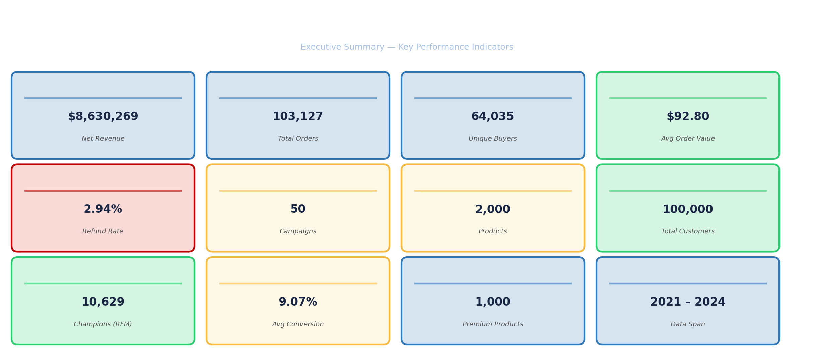
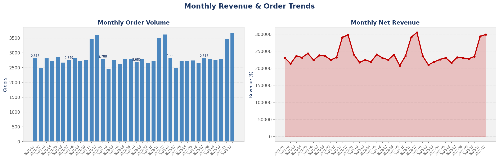
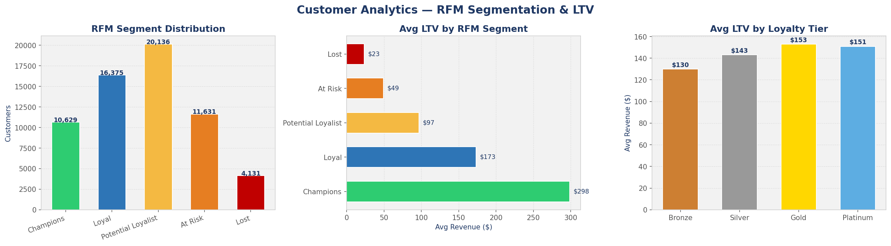
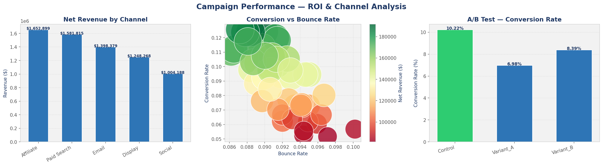
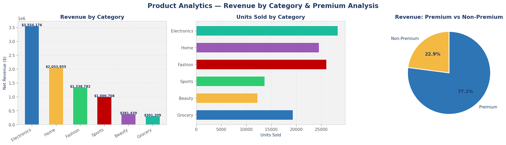
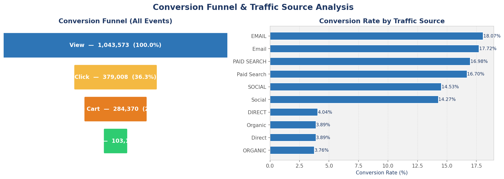
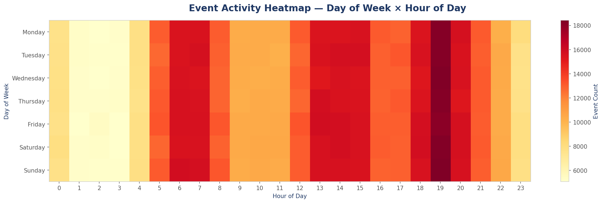
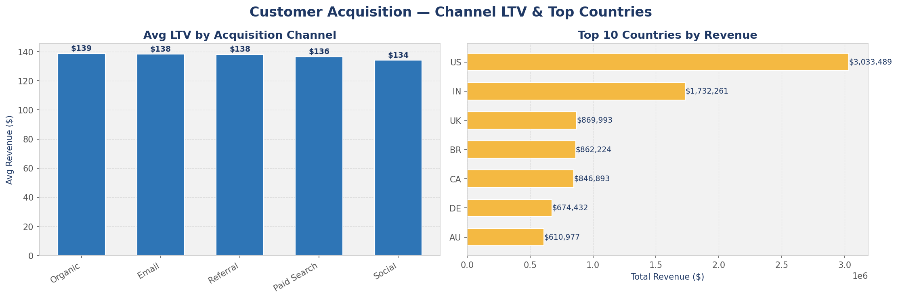
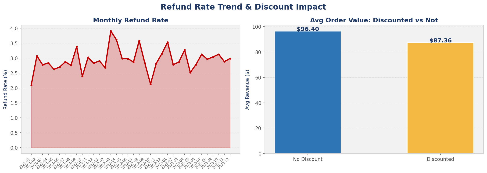
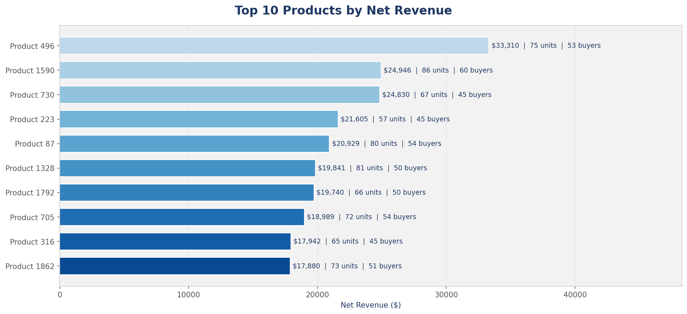

# Marketing & E-Commerce Analytics

A full **Data Analytics / Business Analytics / Data Engineering** project built on the [Marketing & E-Commerce Analytics Dataset](https://www.kaggle.com/datasets/geethasagarbonthu/marketing-and-e-commerce-analytics-dataset/data).

---

## Dataset

| File | Rows | Description |
|---|---|---|
| `campaigns.csv` | 50 | Channel, objective, target segment, expected uplift |
| `customers.csv` | 100,000 | Demographics, loyalty tier, acquisition channel |
| `events.csv` | 2,000,000 | Clickstream — views, clicks, carts, purchases, bounces |
| `products.csv` | 2,000 | Category, brand, price, premium flag |
| `transactions.csv` | 103,127 | Revenue, discounts, refunds |

---

## Project Structure

```
marketing-ecommerce-analysis/
├── data/
│   ├── raw/               # Original CSVs
│   └── warehouse.duckdb   # DuckDB local warehouse (generated)
│
├── pipeline/              # DATA ENGINEERING
│   ├── ingest.py          # Load raw CSVs
│   ├── clean.py           # Type casting, null handling, derived columns
│   ├── transform.py       # Build analytical marts (Customer 360, Campaign Performance, Funnel, Products)
│   ├── load.py            # Persist to DuckDB
│   └── run_pipeline.py    # Orchestrator — run everything end-to-end
│
├── notebooks/             # JUPYTER ANALYSIS
│   ├── 01_eda.ipynb                       # Exploratory Data Analysis
│   ├── 02_customer_analysis.ipynb         # RFM segmentation, LTV, cohort analysis
│   ├── 03_campaign_analysis.ipynb         # Campaign ROI, A/B testing
│   ├── 04_revenue_product_analysis.ipynb  # Revenue trends, discount & refund analysis
│   └── 05_funnel_behavioral_analysis.ipynb # Funnel, device, session heatmaps
│
├── sql/
│   └── queries.sql        # Key analytical SQL queries (DuckDB dialect)
│
├── export/                # EXCEL & POWER BI EXPORTS
│   ├── export_excel.py    # Generates formatted Excel workbook with charts
│   └── export_powerbi.py  # Generates CSVs + date dimension for Power BI
│
└── requirements.txt
```

---

## Analytical Marts (DuckDB)

| Mart | Description |
|---|---|
| `mart_customer_360` | Per-customer: RFM scores, LTV, recency, order history, session behavior |
| `mart_campaign_performance` | Per-campaign: revenue, conversion rate, bounce rate, revenue per visitor |
| `mart_funnel` | Aggregate funnel: view → click → add_to_cart → purchase with drop-off rates |
| `mart_product_performance` | Per-product: units sold, revenue, discount rate, unique buyers |

---

## Quick Start

```bash
# 1. Install dependencies
pip install -r requirements.txt

# 2. Run the ETL pipeline (generates DuckDB warehouse)
python pipeline/run_pipeline.py

# 3. Export to Excel (opens in Excel/Numbers)
python export/export_excel.py
# → exports/Marketing_Ecommerce_Analytics.xlsx

# 4. Export to Power BI CSVs
python export/export_powerbi.py
# → exports/powerbi/*.csv  (import all into Power BI Desktop)

# 5. (Optional) Generate & open Jupyter notebooks
python notebooks/generate_notebooks.py
jupyter lab
```

## Power BI Setup
1. Open Power BI Desktop → **Get Data → Text/CSV**
2. Import all files from `exports/powerbi/`
3. In **Model view**, create these relationships:
   - `fact_transactions[customer_id]` → `dim_customers[customer_id]`
   - `fact_transactions[product_id]` → `dim_products[product_id]`
   - `fact_transactions[campaign_id]` → `dim_campaigns[campaign_id]`
   - `fact_transactions[date]` → `dim_date[date]`
4. Key DAX measures:
```dax
Total Revenue   = SUM(fact_transactions[net_revenue])
Total Orders    = COUNTROWS(fact_transactions)
Avg Order Value = AVERAGE(fact_transactions[net_revenue])
Refund Rate     = DIVIDE(COUNTROWS(FILTER(fact_transactions, fact_transactions[refund_flag]=1)), COUNTROWS(fact_transactions))
```

---

## Key Insights Covered

- **Revenue trends** — monthly orders, AOV, refund rates
- **Customer segmentation** — RFM (Champions → Lost), loyalty tier, LTV by acquisition channel
- **Campaign ROI** — revenue per channel, conversion vs bounce, expected vs actual uplift
- **A/B Testing** — chi-squared significance test across experiment groups
- **Conversion funnel** — view → purchase drop-off by device and traffic source
- **Behavioral patterns** — hourly/daily heatmaps, session duration by page category
- **Product analysis** — top products, category revenue, premium vs non-premium

---

## Analysis Screenshots

### 01 — Executive Summary (KPI Cards)


### 02 — Monthly Revenue & Order Trends


### 03 — Customer Analytics (RFM Segmentation & LTV)


### 04 — Campaign Performance (ROI & A/B Test)


### 05 — Product Analytics


### 06 — Conversion Funnel & Traffic Sources


### 07 — Behavioral Heatmap (Day × Hour)


### 08 — Acquisition Channels & Country Revenue


### 09 — Refund Rate & Discount Impact


### 10 — Top 10 Products by Revenue


---

## Tech Stack

| Layer | Tool |
|---|---|
| Data Warehouse | DuckDB |
| ETL / Transformation | Python (pandas) |
| Analysis | Jupyter, pandas, scipy |
| Visualization | Plotly, matplotlib, seaborn |
| Dashboard | Streamlit |
| Version Control | Git / GitHub |
